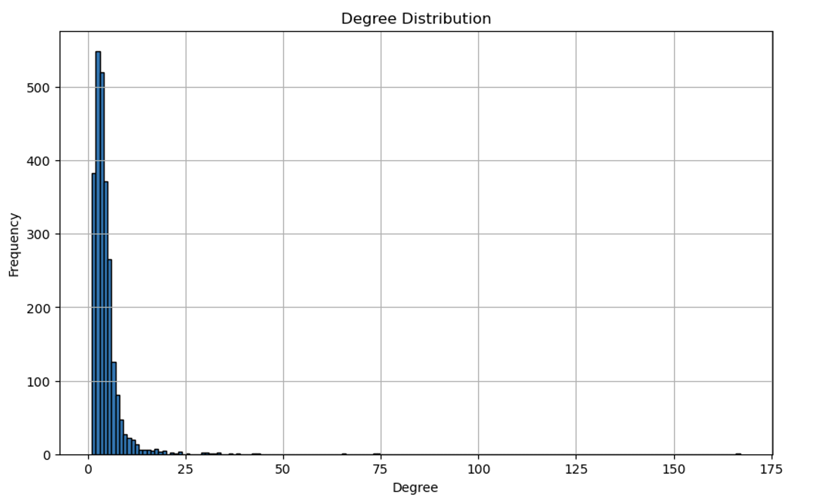

# Link Prediction in Graph Networks

## **Project Description**
Link prediction is the task of predicting whether connections between certain nodes in an existing graph will likely appear in the future. It is frequently applied to social networks, where possible friends or future connections can be predicted and recommended to users.

In this project, various link prediction methodologies are applied to an existing graph dataset and a testing set of links. The overall goal of the project was to achieve the highest possible accuracy on the testing set of links. To achieve this goal, multiple approaches were experimented on. These included multi-hop methods such as the Katz Index, adjacency-based techniques like the Jaccard similarity and Adamic-Adar index, as well as using node-level features to generate embeddings for a Graph Convolutional Network (GCN) and performing binary classification using the generated embeddings. Additionally, an ensemble where all of the individual scores were summed together were also used in an attempt to increase accuracy performance.

## **Project Code and Dependencies**
All of the source code for this project was written in Python and can be found within at [https://github.com/JoshuaWang8/link-prediction](https://github.com/JoshuaWang8/link-prediction). This repository contains 7 Python files which are:

- main.py: Main file for running all methods.
- utilities.py: Functions for loading datasets and writing results.
- neighbourhood_prediction.py: Implementations of adjacency-based methods.
- multi_hop_prediction.py: Implementation of multi-hop method.
- feature_extraction.py: Functions for extracting features for GCN
- gcn.py: Implementation of GCN
- embedding_distances.py: Implementation of embedding distance method.

This directory will also include link_pred_model_weights_concat.pth, which is the file containing the saved weights for the neural network model used in one of the link prediction methods. To run the code and perform predictions, first ensure that the following dependencies are installed:

- Python (version 3.11)
- PyTorch (version 3.11)
- Sci-kit learn (version 1.2.2)
- Numpy (version 1.26.0)
- Pandas (version 2.0.3)
- NetworkX (version 2.8.8)

Other versions of the above libraries may also be sufficient. Next, in the command line, navigate to the directory with ‘main.py’ and run the file using ‘python3 main.py’. This will perform link prediction using the method which achieved the best testing performance overall. To test other methods, simply change the scoring method being considered in line 84 of ‘main.py’.

## **Methodology**

### Adjacency-Based Methods:

The first category of methodologies explored for link prediction were adjacency-based methods, which perform by observing the number of shared nodes between two nodes. From this category of methodologies, the implemented prediction techniques included the Jaccard similarity, Cosine similarity and the Adamic-Adar index. With $N(X)$ denoting the neighbors of node $X$ and $|N(X)|$ denoting the number of neighbors for node $X$, the formulas for each of the implemented adjacency-based methods are:

$$
jaccard\_similarity = \frac{|N(A)\cap N(B)|}{|N(A)\cup N(B)|}
$$

$$
cosine\_similarity = \frac{|N(A)\cap N(B)|}{\sqrt{|N(A)||N(B)|}}
$$

$$
adamic\_adar\_index = \sum_{z\in N(A)\cap N(B)}{\frac{1}{log|N(z)|}}
$$

Jaccard similarity works by considering how many neighbors are shared by nodes A and B out of the total number of neighbors possible, and where there is a large number of neighbors being shared between two nodes, it would mean that the two nodes are similar and will therefore be more likely to have a link. Meanwhile, cosine similarity measures the similarity between nodes by dividing the number of shared neighbors by $\sqrt{|N(A)||N(B)|}$ to normalize the resulting value into the range of [0, 1]. The Adamic-Adar index also performs similarly by considering the number of shared neighbors between two nodes, though it instead sums the reciprocal log of the degrees of the shared neighbors. By doing this, instead of only considering which nodes are shared like the Jaccard and cosine similarities, the Adamic-Adar index is able to penalize the similarity when two nodes are connected to extremely popular nodes. This is an important feature since, in social networks, there are often more popular/influential nodes such as celebrities, and many nodes may be connected to these. Thus, if the majority of shared neighbors between two nodes are “popular” nodes with high degree, it may not necessarily mean that the two nodes are similar to each other and should be connected. For all three of these methods, a greater score indicates a more likely link.

In contrast to the methods which consider the number of shared nodes, a method that approaches the problem in a different way is preferential attachment. Preferential attachment is based off evidence found by researchers that co-authorship of papers is correlated with the product of the neighborhood sizes of each node. In this technique, it is assumed that new links will likely be formed between those who are more popular, and the scoring is formulated as:

$$
preferential\_attachment = |N(A)||N(B)|
$$

Here, the number of neighbors for each node A and B in the link are multiplied, and a larger preferential attachment score would indicate a more likely link.

The above adjacency-based methods were all chosen since it makes logical sense that for a link prediction task, it is likely that nodes which share neighbors or have similar features will also be more likely to share a link. Additionally, since each of the adjacency methods have their respective advantages and disadvantages, such as Adamic-Adar index being capable of reducing the impact of popular nodes whilst preferential attachment applied the concept of more popular nodes preferring to connect with each other, all of the four aforementioned methods were applied.

### Multi-Hop Technique:
The Katz measure is a multi-hop technique and was another methodology that was applied in this project. It finds the total number of paths of a specified length between two nodes, and gives a higher weight to shorter paths. To find the Katz measures for each pair of data, an adjacency matrix of the entire training graph was first created. Next, to limit the lengths of paths to just 3, the dot product was applied to the adjacency matrix 2 times to obtain three adjacency matrices: $A$, $A^2$ and $A^3$, which give the number of paths of length one, two and three respectively. Then, for each pair of nodes being evaluated, the number of paths between the two nodes was found by looking in the respective row and columns of each matrix. Weights of $0.1$, $0.1^2$ and $0.1^3$ were applied to the number of paths found in matrices $A$, $A^2$ and $A^3$ respectively, and these were totaled to obtain the final Katz measure. The reasoning behind implementing the Katz measure for this project is that a survey by Goyal and Ferrara [1] showed that multi-hop methods tended to perform better on link prediction tasks than other methods such as random-walk approaches.

### Node Embedding-Based Methods:
The next technique attempted was using embeddings for each of the nodes. To do this, the first step was to define the node features to consider, or in other words, how each node would be represented. To decide on the node-level features to include, an important balance between the representativeness of the features and the number of features had to be considered. On one hand, with too many features, the embeddings could become extremely specific and any methods which performed link prediction on these embeddings may struggle to perform well on new data. On the other hand, with too few features or features which could not represent each node well, any models using the embeddings for prediction would struggle to understand patterns between the embeddings and the existence of links. The 5 key features that were included were:

1. PageRank: Measure of influence of a node in the graph, useful for identifying influential nodes
2. Betweenness Centrality: Quantifies how often a node appears on a shortest path between other nodes, important for understanding potential bottlenecks in the network
3. Closeness Centrality: Measures how close a node is to all other nodes, can help with identifying nodes likely to form links within a community
4. Katz Centrality: Evaluates a node’s influence by considering its neighbors, as well as the nodes connected to its neighbors
5. Eigenvector Centrality: Measures node’s influence based on the influence of its neighbors, and can be helpful for networks with high-degree nodes

With these features extracted for all nodes in the graph, each feature was then normalized to ensure that the differences in the scale of each feature would not impact performance. The GCN could then be used to obtain an embedding of each node. This was performed by taking:

$$
D^{-1}(A+I)F
$$

where $D$ is the degree matrix, $A$ is the adjacency matrix, $I$ is the identity matrix with one row and column for each node, and $F$ is the matrix of features for each node. First, by calculating $A+I$, self-loops were added to the adjacency matrix, so that each node’s own features would be considered in the embeddings. By multiplying the adjacency matrix with the inverse degree matrix, the adjacency matrix would be normalized such that the weights for neighboring nodes would be relative to the degree of the matrix. And finally, multiplying with the feature matrix would give the embeddings for each node, where each embedding includes the features of the node itself, and also an aggregate of its neighboring nodes.

#### **Binary Classification on Node Embeddings**
Using these embeddings, two methods were applied. The first was by concatenating embeddings of nodes that could potentially share a link, and passing this concatenated embedding to a deep learning model. This model was trained using binary cross entropy as its loss and gave a single output between 0 and 1 representing the probability of the two nodes sharing a link (1 being 100% probability of a link). However, to train this deep learning model, training data would also be required, and this needed to include examples of when links should and should not exist. To obtain this, a list of all existing links in the original training graph was created, and for each of the nodes that had links, an equal number of node pairings with no links were randomly selected. This resulted in a dataset of 19,876 examples for training, with half of them being positive pairs whilst the other half not having a link. Using this sample of node pairings and links from the training graph, as well as the concatenated node embeddings, the model was trained to automatically adjust its weights to classify when a link was expected. The model that was used for binary classification consisted of 6 linear layers, with each having 32, 16, 16, 8, 4, 1 hidden nodes, in that particular order. Since each embedding had 5 features, the concatenated embeddings became a length of 10, and each of the 6 layers were trained such that the final layer with a single node would produce a value between 0 and 1 to indicate the likelihood of a link. The full model architecture can be seen in the diagram below.

  

#### **Node Embedding Distances**
The second method making use of the node embeddings was by considering the differences between embeddings. Since the embeddings could represent each node, it would be logical that nodes with similar embeddings would be more likely to have a link, whilst embeddings more different from each other would be less likely to have a link. Therefore, this method took the Euclidean distance between the embeddings of nodes, and considered nodes with smaller distances to be more likely to have a link. The Euclidean distance was calculated as:

$$
distance = \sqrt{\sum{(embedding_1 - embedding_2)^2}}
$$

where element-wise subtraction was performed on the embeddings, each of these elements were squared, and then element-wise addition was performed before the square root function.

### Ensemble Method:
The final technique this project explored was by using all the previously aforementioned methodologies, and aggregating them as an ensemble. This was chosen since aggregating each separate prediction method would allow the methods to “vote” on which links would be more likely, and if a single method performed poorly in one area, the combination of other methods could potentially help to correct the error. To perform this, each of the above methods were first scaled between 0 and 1 so that the scale of the scores would not have a significant impact. As an example, preferential attachment could achieve an extremely large score since it works by multiplying the sizes of the nodes’ neighbors, but cosine similarity with its values limited to the range of [0, 1] would not contribute significantly to the final decision. Once each individual scoring method was scaled, they were all summed to give the final score for the link, where a larger score meant a more likely link.

## **Results**
The table below summarizes the testing accuracies for all methods that were implemented:

|                 Method                 | Testing Accuracy |
|:--------------------------------------:|:----------------:|
|           Jaccard Similarity           |      90.30%      |
|            Cosine Similarity           |      90.30%      |
|         Preferential Attachment        |      84.70%      |
|            Adamic-Adar Index           |      90.30%      |
|              Katz Measure              |      83.30%      |
| GCN + Binary Classifier Neural Network |      85.30%      |
|           Embedding Distances          |      82.70%      |
|            Combined Ensemble           |      91.50%      |

From the above results, we can find that, in general, the adjacency-based techniques achieved stronger performance on the testing set, with Jaccard similarity, cosine similarity and Adamic-Adar index able to achieve an accuracy of 90.30% by themselves without considering the predictions of other methods. The similarity in results between Jaccard and cosine similarities is expected, as both methods measure the overlap between the neighbors of two nodes. The Jaccard similarity is the ratio of shared to total neighbors, while cosine similarity normalizes the count of shared neighbors by the geometric mean of the degrees of the nodes into a range of 0 to 1. Since both metrics ultimately depend on the shared neighbors, although the exact scores from the two methods may differ, they tend to produce similar rankings for links in networks with relatively consistent degree distributions.

  

Additionally, the Adamic-Adar index achieving the same accuracy scores as Jaccard and cosine similarities indicates that taking the logarithmic reciprocal of the degree for all shared nodes did not offer any significant advantages over the other two methods, and it is likely that there are few “popular” nodes in the shared neighborhood of nodes in the training graph. This observation is supported by the plot of the degree distributions above. In this plot, we can see that the distribution of node degrees is heavily right-skewed, where the majority of node degrees are small and there are very few nodes with high degree. Therefore, with very few extremely influential nodes in the graph, the main advantage of the Adamic-Adar index being able to decrease the influence of shared influential nodes would not make much of a change and the resulting ranking of possible links became similar to the Jaccard and cosine similarities.

Using the preferential attachment method, a testing accuracy of only 84.70% was achieved. Again, because this method predicts links based on the product of the node degrees and assumes that nodes with higher degrees are more likely to form new links, with the training graph for this project containing very few nodes with high degree, the product of neighborhood sizes did not correlate well with the actual link formation. As a result, the rankings generated by preferential attachment became less useful for predicting links.

In an attempt to improve on the performance of the previous adjacency-based methods, the Katz measure was implemented. However, this proved to perform even worse, with a testing accuracy of 83.30%. One reason for this is result is likely also due to the lack of high-degree nodes. Since the Katz measure not only considers the number of direct neighbors, but also the number of indirect paths connecting two nodes, with a lack of high-degree nodes in the dataset, it was unable to capture any meaningful long-range connections for link prediction. Furthermore, the Katz measure’s consideration of longer paths between nodes also does not add much useful information for link prediction if the training graph is sparse. To check whether a graph is sparse, the following formula can be used:

$$
density = \frac{number\ of\ edges\ in\ a\ graph}{maximum\ number\ of\ edges\ possible\ for\ graph}
$$

where the maximum number of edges for a graph can be calculated by taking $\frac{n(n-1)}{2}$, with $n$ being the number of nodes in the graph. Using this equation, we find that the density for the graph used in this project is:

$$
density = \frac{4969}{3086370} \approx 0.0016
$$

Given that the density for the training graph is extremely small, we can conclude that the graph is sparse and thus the Katz measure is unable to provide stronger performance by considering longer paths between nodes.

The method of using a Graph Convolutional Network to create embeddings for each node, and concatenating the embeddings before passing them to a deep learning neural network for binary classification also only achieved a testing accuracy of 85.30%. This model, during training, seemed to perform relatively well, with the training and validation losses both decreasing at a steady rate, as evident in the graph of the losses below. This showed that the model was able to learn weights such that it could understand whether a link should exist between nodes in the training set whilst also being able to generalize well to new nodes.

  

In the loss graph, it can be observed that the loss would plateau at around 0.35 for both models, meaning that it was unable to perform even better than the current accuracy. To try and improve this model, various other techniques were tested, such as including more features per node or including more layers into the binary classifier. By doing this, the model would have more inputted information per node via the embeddings, as well as more weights to better learn patterns between embeddings and whether there exists a link between the respective nodes. However, all changes that were experimented with only resulted in the binary classifier overfitting on the training data and would struggle to perform well on new unseen data. The cause of this is likely to have been that the embeddings generated by the GCN using the node-level features were not extremely meaningful, since they were created using different centrality measures as its features, and given that the graph is sparse, these features may not have formed any clear patterns for link prediction.

The final stand-alone method of only considering the distances between embeddings performed the worst overall, at 82.70% accuracy. Again, this is likely because of the node-level feature embeddings not being meaningful enough, and thus even when two embeddings were similar, it did not necessarily mean that they would be linked.

The last technique of using an ensemble that considered all of the stand-alone methods implemented previously was able to achieve the best possible testing accuracy for this project at 91.50%. Though, to achieve this score, a small adjustment to the voting process was made. Instead of simply summing all the standardized scores for each individual method, it was discovered that increasing the importance of the individual methods that performed more accurately could also yield prediction results that were stronger. Therefore, since Jaccard similarity, cosine similarity and Adamic-Adar index were the strongest individual methods, these were each multiplied by 1.5 before being combined into the final scoring. The reasoning behind why increasing the weighting of the stronger-performing methods is that, since they are able to perform more accurately by themselves, increasing their weightings makes the contributions of these methods more important to the final result, so that the majority of the scoring could be more accurately computed. Then, because the weaker individual methods performed worse by themselves, giving them less importance in the final vote meant they would not incorrectly conflict with the decisions made by stronger methods. However, they could contribute by making small differentiations between which links are more likely to exist in cases where the Jaccard similarity, cosine similarity and Adamic-Adar index predictions resulted in ties or rankings with extremely small differences.

## **Summary**
In summary, this project has implemented 8 different methodologies to perform link prediction. By evaluating the performance of each of these methodologies, it was found that adjacency-based methods such as the Jaccard similarity, cosine similarity, and Adamic-Adar index could provide the strongest independent-method testing performance, whilst other methods such as those using embeddings, the Katz measure, and preferential attachment performed poorly due to the sparsity of the graph.

Overall, however, by considering all of the individual methodologies, scaling their scores, and summing them, the resulting ensemble voting score was able to achieve a testing accuracy of 91.50%. For this method, it was found that the weightings of each score was important, as the stronger performing techniques needed to have a greater weighting than those that performed poorer to ensure that the best predictions were considered.

These findings are significant as they show that certain link prediction methods struggle to achieve strong performances on sparse graphs due to not enough information being available for prediction. However, despite the challenge of the training graph being extremely sparse, the ensemble method implemented was still capable of predicting at 91.50% accuracy, which is a relatively strong result. In the future, other potential areas for further investigation include trying other methods that are more capable of capturing the structure of the nodes in the graphs, such as the node2vec methodology, as well as identifying which node-level features considered by the GCN embeddings would be most relevant and give the most optimal performance for a sparse graph.

## **References**
[1]. Goyal, P., & Ferrara, E. (2017, December 22). Graph embedding techniques, applications, and performance: A survey. arXiv.org. https://arxiv.org/abs/1705.02801
